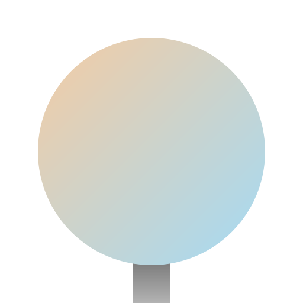

# Adaptive Lighting

**Enhance Your Home's Atmosphere with Smart, Sun-Synchronized Lighting**

<div style="text-align: center; margin: 2rem 0;">
  
</div>

[Adaptive Lighting](https://github.com/basnijholt/adaptive-lighting) is a custom component for [Home Assistant](https://www.home-assistant.io/) that intelligently adjusts the brightness and color of your lights based on the sun's position, while still allowing for manual control.

<div style="text-align: center; margin: 2rem 0;">
  <a href="https://my.home-assistant.io/redirect/hacs_repository/?owner=basnijholt&repository=adaptive-lighting&category=integration" class="md-button md-button--primary">
    Install via HACS
  </a>
  <a href="simulator/" class="md-button">
    Try the Simulator
  </a>
</div>

By automatically adapting the settings of your lights throughout the day, Adaptive Lighting helps maintain your natural circadian rhythm, which can lead to improved sleep, mood, and overall well-being. Experience cooler color temperatures at noon, gradually transitioning to warmer colors at sunset and sunrise.

## Features

<!-- CODE:START -->
<!-- from adaptive_lighting.docs_gen import readme_section -->
<!-- print(readme_section("features")) -->
<!-- CODE:END -->
<!-- OUTPUT:START -->
<!-- ⚠️ This content is auto-generated by `markdown-code-runner`. -->
When initially turning on a light that is controlled by Adaptive Lighting, the `light.turn_on` service call is intercepted, and the light's brightness and color are automatically adjusted based on the sun's position.
After that, the light's brightness and color are automatically adjusted at a regular interval.

Adaptive Lighting provides four switches (using "living_room" as an example component name):

- `switch.adaptive_lighting_living_room`: Turn Adaptive Lighting on or off and view current light settings through its attributes.
- `switch.adaptive_lighting_sleep_mode_living_room`: Activate "sleep mode" 😴 and set custom sleep_brightness and sleep_color_temp.
- `switch.adaptive_lighting_adapt_brightness_living_room`: Enable or disable brightness adaptation 🔆 for supported lights.
- `switch.adaptive_lighting_adapt_color_living_room`: Enable or disable color adaptation 🌈 for supported lights.

<!-- OUTPUT:END -->

## Quick Start

1. **Install via HACS**: Search for "Adaptive Lighting" in the [Home Assistant Community Store](https://hacs.xyz/)
2. **Add to configuration**: Add `adaptive_lighting:` to your `configuration.yaml`
3. **Configure**: Go to **Settings** → **Devices & Services** → **Add Integration** → **Adaptive Lighting**
4. **Select your lights**: Choose which lights to control and enjoy automatic adaptation!

```yaml
# Minimal configuration.yaml entry
adaptive_lighting:
  lights:
    - light.living_room
```

> [!TIP]
> **Using the UI exclusively?** Even if you plan to configure everything through the UI, the `adaptive_lighting:` entry must still be present in your `configuration.yaml`.

[Get Started →](getting-started.md){ .md-button .md-button--primary }
[View All Options →](configuration.md){ .md-button }

## How It Works

Adaptive Lighting provides four switches for each configuration (using "living_room" as an example):

| Switch | Purpose |
|--------|---------|
| `switch.adaptive_lighting_living_room` | Main on/off control |
| `switch.adaptive_lighting_sleep_mode_living_room` | Activate sleep mode |
| `switch.adaptive_lighting_adapt_brightness_living_room` | Enable/disable brightness adaptation |
| `switch.adaptive_lighting_adapt_color_living_room` | Enable/disable color adaptation |

## Interactive Simulator

Visualize how Adaptive Lighting will work with your settings using the interactive simulator:

<div style="text-align: center; margin: 2rem 0;">
  <a href="simulator/" class="simulator-link">
    Try the Interactive Simulator
  </a>
</div>
